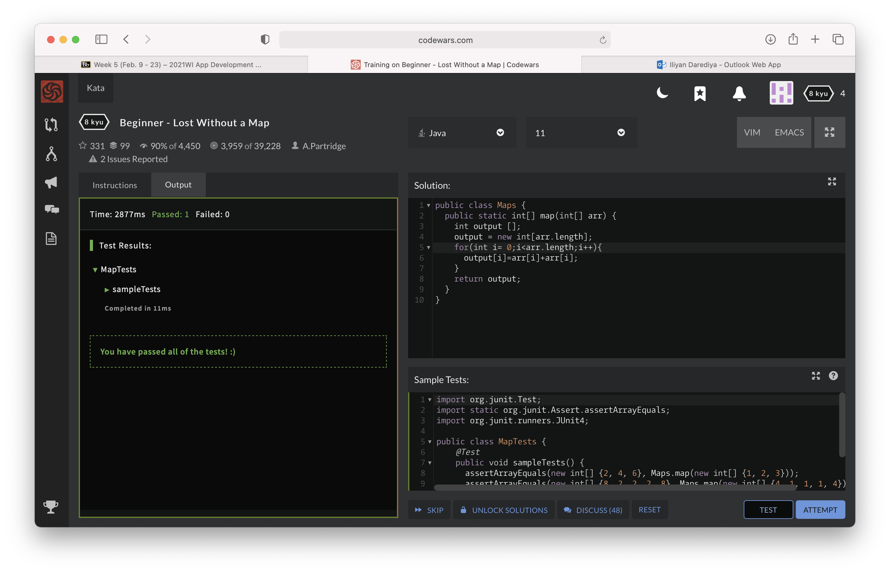
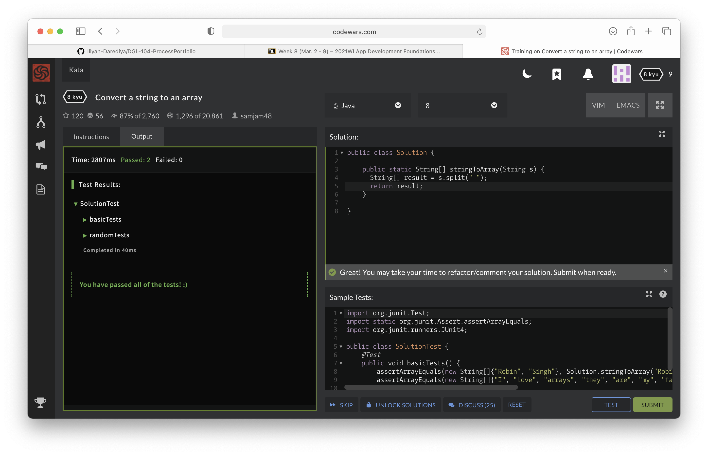

# DGL-104-ProcessPortfolio

## Week-1

### 0101

I was trying to study React early on. I was going through the lifecycle method componentDidUpdate but I was facing an issue. That was that every time I updated the state, the method would run, but it would run indefinitely.Now that I look at it I reckon passing in the previous state and using a simple if statement to check if the previous state and current state are different, would help solve the problem.Another method would be to use Hooks and pass in the array of the state that needs checking.

### 0102

In CPS-100 we were usually asked to write the pseudo code in comments and then build on our code. I found it a bit undesirable to do so, but failing to add comments would cost me marks so I used to just add them at the end.But this would in return be grounds for another problem- readability. I got into the habit of writing comments that were too descriptive. Thanks to eclipse’s format feature I was able to indent my code just by using ctrl+shift+f. I could also use appropriate descriptive names. 

## Week-2

### 0202

Considering the React project I was working on, they weren't qutie descriptive.

The following are the changes I would like to make in them
Changing name of the following variables and methods:

  - from d to date
  - from n to name
  - from uploadinglist to setList
  - from get_user_data_to_state to getUserData
  - from changingthestate to handleChange
  

I reckon using proper variable names would be quite helpful in the long run.Reading the code after a long time,I couldn't understand what the words d and n represented. If at all I were to send my code to some other developer I might have to put in the extra hardwork document what each word meant

### 0203

I found the kata to be quite simple. It barely took me a minute to figure out the logic. Although I had to spend a couple on debugging.

## Week-3

### 0301

The app that I choose for comparison is Instagram. I tried to find screenshots of it on an IOS device, but I couldn't. So I'm comparing its android interface with the web interface.

The key differnces I found are as follows

  -  The app on android covers larger width by percentage,than the web does.
  -  The header section of the web app consists of the app name, a search bar and a log in details section.
  -  The header section of the android app only has the back option and the more option in its header
  -  The web app doesn't display the new reels feature, whereas the mobile app does.
  -  Hovering over the posts on the web app gives us the number of likes and comments on a particular post, long Pressing the post on the mobile app doesn't give us this option
  

### 0302

The document I choose is <a href = "https://developer.apple.com/documentation/applemusicapi">Apple Music.</a> 

The documentation was short and consise. It showed how the key;tokens and response ; request are handled. It also provided details on how we can find a particular album, artist or song. It also talked about the playlist feature. It provide an insight in terms of music genres and ratings. The musicKit Js article was a related article, it talked about how to use applemusic in our own application 

## Week-4

### 0401

https://pttrns.com/applications/763

This is the pattern that I chose.

The reson I choose this pattern is because I feel that this pattern has a subtle navigation layout throught. It has a certain way of its management in terms of graphics and spacing. This pattern can be well used by users who prefer the one-hand use option. I believe that all the elements in this pattern are well responsive 

### 0403

## Week-5

### 0501

simmilarities and differnces
| MVC  | MCP | MVVM |
| ------------- | ------------- | ------------- |
| No interaction between View and the Model | Interaction between View and Presenter exists  | No interaction between View and the Model  |
| The input is handled by the controller  | The input is handled by the View  | The input is handled by the controller  |
| One of the oldest software architecture  | It is developed as the second iteration of software architecture which is advance from MVC.  | Currently it is the industry-recognized architecture pattern for applications.  |

I would choose MVC when my user wants to access my model and want's its information on the view.I would use MVP if the effect on the update is limited. I would opt for MVVM if my app is using lots of views

### 0502

## Week-8

### 0802
App Chosen: WatsApp

  -  I reckon that there is only one resource that is critical to the app's functionality and that it disk storage. 
  -  For every message, document, link the user receives the user's personal disk storage keeps on being inflicted.
  -  The developer should keep that in mind and make the data stored on cloud like discord.
  -  At times the app does affect the processing power of the device. For instance when the device loads a lot of messages, because the user was offline for a while or when the user receives or uploads documents that are a bit large.

### 0803

## Week-9

### 0901
App Chosen: WatsApp and snapChat

Use Of notification:

- WatsApp
  - Notifies the user when the user gets a message
  - Notifies the user when the user gets a voice or a video call 
- SnapChat
  - Notifies the user when they get a message
  - Notifies the user when someone is typing a message
  - Notifies the user when someone took a screenshot of either their story of their chat

Offline usage:

- WatsApp
  - Allows the user to view past messages
  - The user cannot send or receive messages or calls
- SnapChat
  - The user cannot view the stories or messages.
  - The user can view the snaps stored in their local storage
  - Notifies the user when someone is typing a message

### 0903

- I am quite certain that I've used all the four steps while debugging
- I believe that I've used the process of hypothesizing and experimenting well
- I reckon I could study my data better,so that would be one step I would like to improve on
- I think that these four methods would work regardless of where the error/situation is, because if we know the error we could fix it by hypothesizing and experimenting. If not we could find the error by studing our data, experimenting and repeating.
